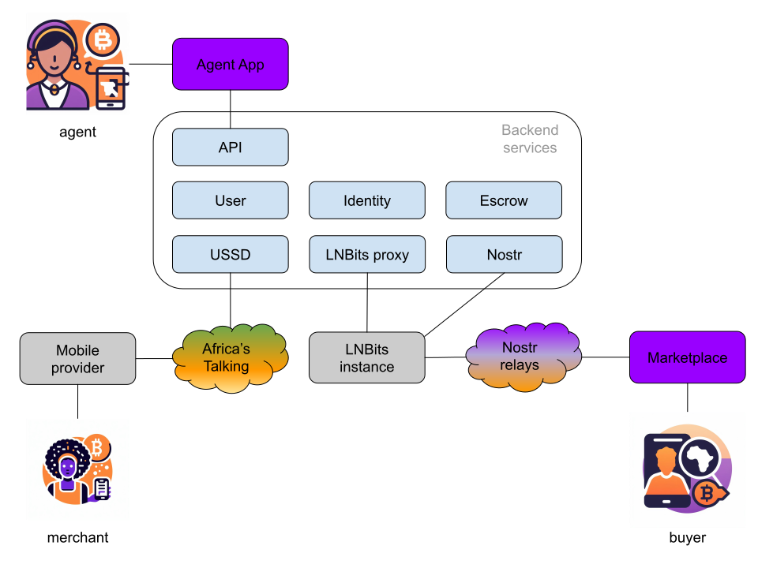

# Architecture

## Overview

We are building a decentralized infrastructure for a borderless & censorship resistant commerce with **Bitcoin/Lightning** for the payments, **Nostr** as a decentralized marketplace, and **USSD** protocol for low-tech access.

**Agents** use the Agent app as a platform to easily manage the stalls and products they are promoting. **Merchants** controls the publishing of products to the marketplace, monitor and manage the orders via USSD interface. Through the decentralized marketplace, **Buyers** can easily browse and order products online. Buyers pay for products using their Lightning wallet and the money goes through a specialized escrow service before being released to the Merchant wallet.

## Back-end services

The backend has microservices architecture design based on _MoleculerJS_. However, for the moment, it is deployed as a monolith application. Some of the services leverages MongoDB as a local storage.

### API

API gateway service that provides front-end application with access to the rest of the services via REST interface.

### User

The User service is responsible for the registration and management of the users - both agents and merchants.

### Identity

The Identity service is designed for managing identity data in a decentralized, secure way, based on Nostr profiles.

### Escrow

The Escrow service manages the payments between buyers and merchants. For each order, it generates a unique code that must be presented by the buyer upon delivery in order to release the payment to the merchant. In its first version, the service controls a custodial escrow wallet, but we envision a non-custodial implementation using HODL invoices or discreet log contracts over Lightning.

### USSD

The USSD service manages menu, navigation and interfaces for the merchant.

### Nostr

The Nostr service is responsible for registration and management of a Nostr profile for each merchant, and facilitation the incoming and outgoing communication of this profile.

### LNBits proxy

The LNBits proxy does exactly what it name suggests - provides access to LNBits APIs.

## Integrations

### Agent app

The Agent app is a web-based applications, built using React.js and Next.js. Authentication is implemented via Nostr connect. Access to the back-end is through REST APIs.

### LNBits

TBD

### Marketplace

TBD
