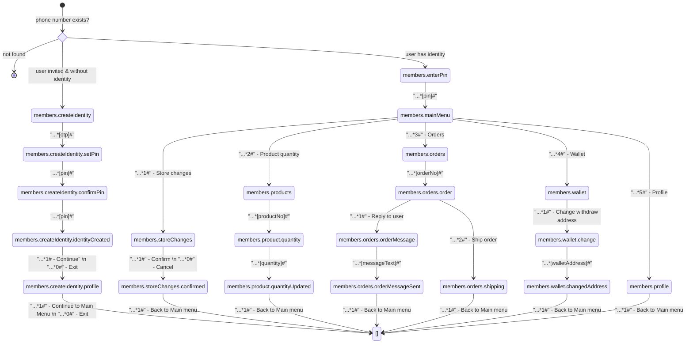

```mermaid
stateDiagram
state if_state <<choice>>
[*] --> if_state: phone number exists?
	if_state --> [*]: not found
    if_state --> members.createIdentity: user invited & without identity
		members.createIdentity --> members.createIdentity.setPin: "...*[otp]#"
		members.createIdentity.setPin --> members.createIdentity.confirmPin: "...*[pin]#"
		members.createIdentity.confirmPin --> members.createIdentity.identityCreated: "...*[pin]#"
		members.createIdentity.identityCreated --> members.createIdentity.profile: "...*1# - Continue" \n "...*0#" - Exit
        members.createIdentity.profile --> []: "...*1#" - Continue to Main Menu \n "...*0#" - Exit
    if_state --> members.enterPin: user has identity
		members.enterPin --> members.mainMenu: "...*[pin]#"
        members.mainMenu --> members.storeChanges: "...*1#" - Store changes
            members.storeChanges --> members.storeChanges.confirmed: "...*1#" - Confirm \n "...*0#" - Cancel
            members.storeChanges.confirmed --> []: "...*1#" - Back to Main menu
        members.mainMenu --> members.products: "...*2#" - Product quantity
            members.products --> members.product.quantity: "...*[productNo]#"
            members.product.quantity --> members.product.quantityUpdated: "...*[quantity]#"
            members.product.quantityUpdated --> []: "...*1#" - Back to Main menu
        members.mainMenu --> members.orders: "...*3#" - Orders
            members.orders --> members.orders.order: "...*[orderNo]#"
            members.orders.order --> members.orders.orderMessage: "...*1#" - Reply to user
                members.orders.orderMessage --> members.orders.orderMessageSent: "...*[messageText]#"
                members.orders.orderMessageSent --> []: "...*1#" - Back to Main menu
            members.orders.order --> members.orders.shipping: "...*2#" - Ship order
                members.orders.shipping --> []: "...*1#" - Back to Main menu
        members.mainMenu --> members.wallet: "...*4#" - Wallet
            members.wallet --> members.wallet.change: "...*1#" - Change withdraw address
            members.wallet.change --> members.wallet.changedAddress: "...*[walletAddress]#"
            members.wallet.changedAddress --> []: "...*1#" - Back to Main menu
        members.mainMenu --> members.profile: "...*5#" - Profile
            members.profile --> []: "...*1#" - Back to Main menu
```
